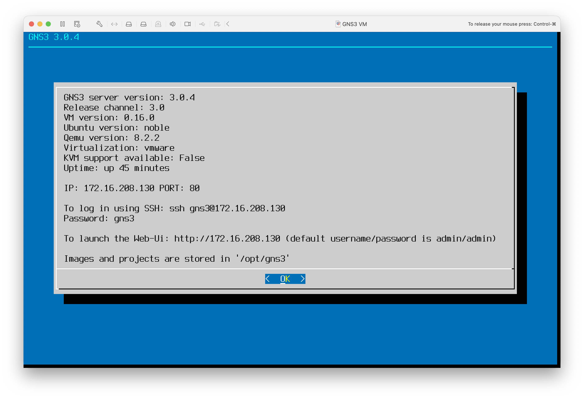
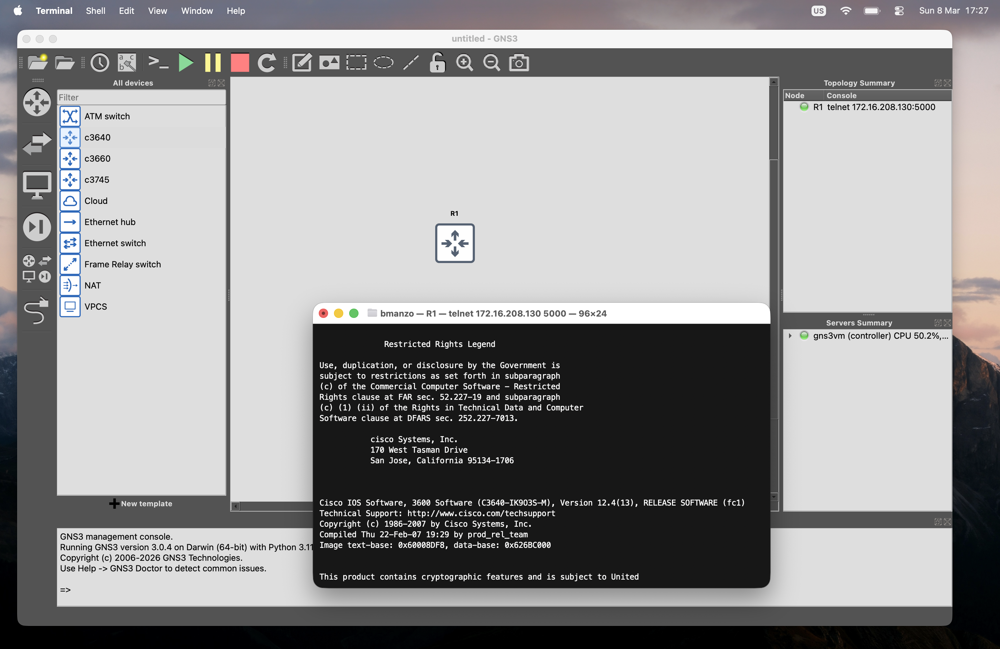
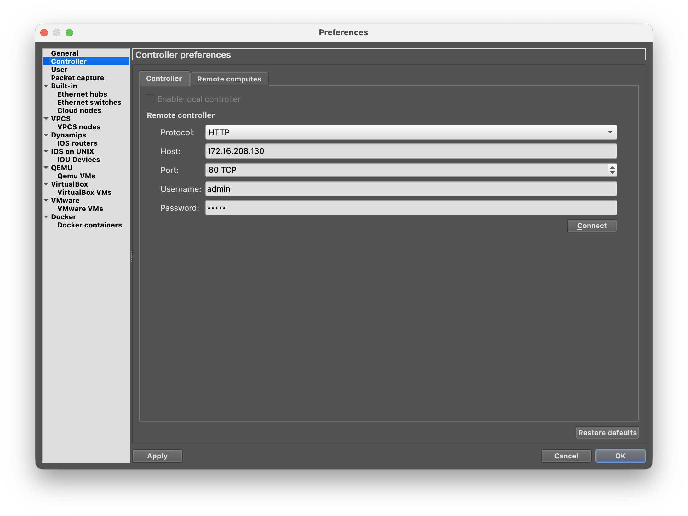
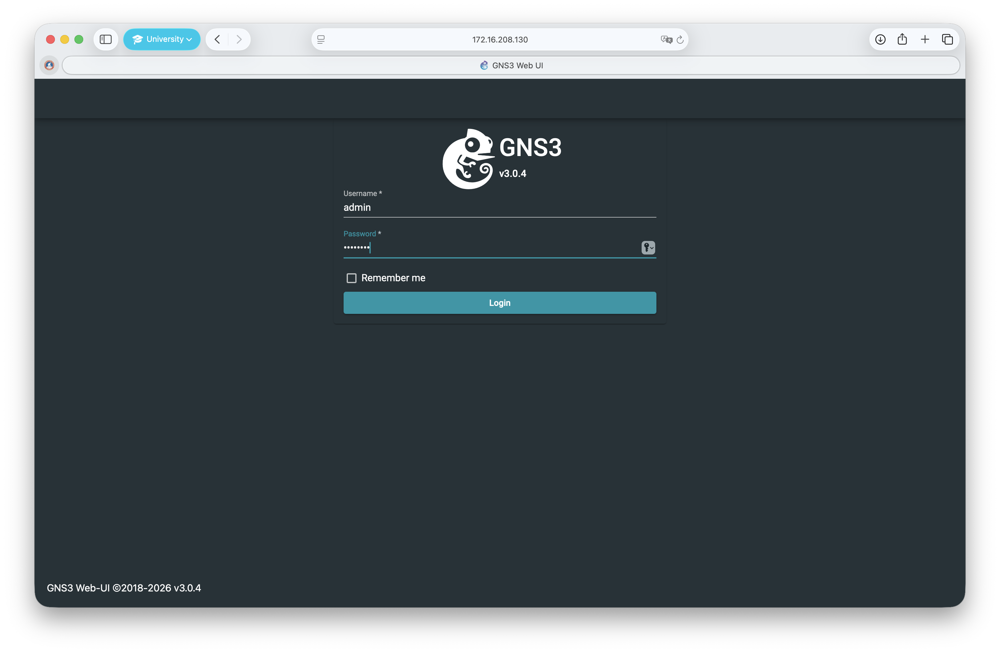
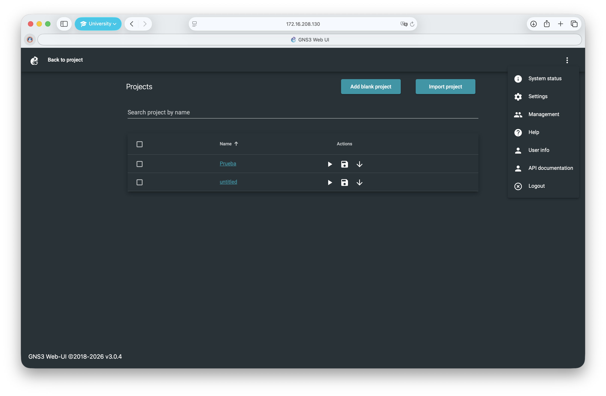
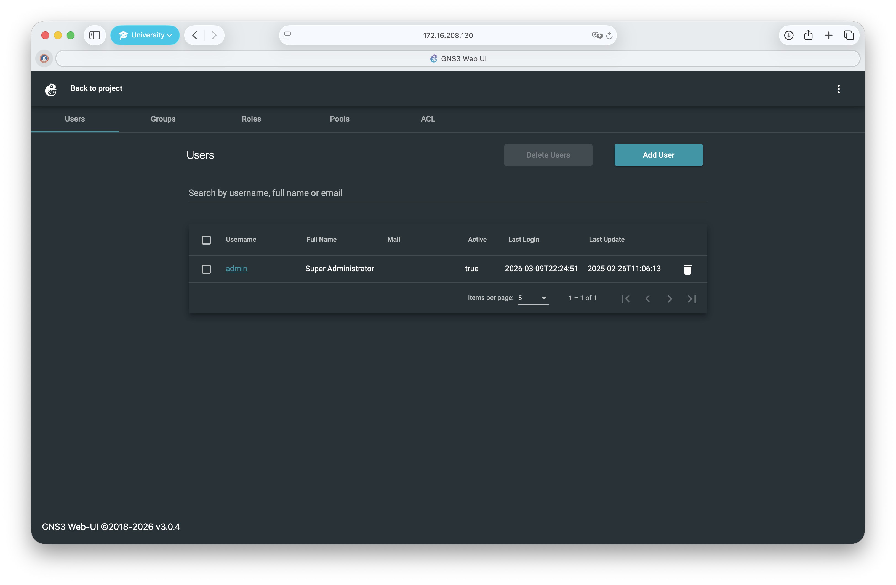
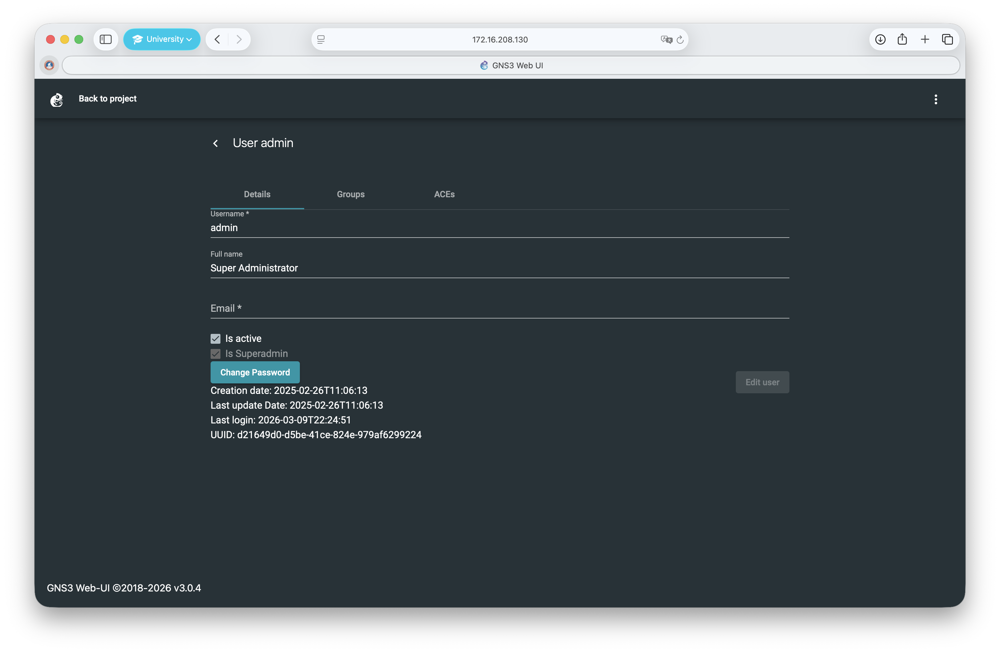

# GNS3 en Apple Silicon

Esta guía documenta cómo instalar y configurar GNS3 en una Mac con Apple Silicon (M1/M2/M3/M4). La VM tradicional de GNS3 no funciona en estos equipos por incompatibilidad de arquitectura, pero existe una solución oficial ARM64 que funciona correctamente.

## Tabla de Contenidos

- [Entendiendo el Problema](#entendiendo-el-problema)
- [Requisitos Previos](#requisitos-previos)
- [Paso 1 — Descargar los Archivos Correctos](#paso-1--descargar-los-archivos-correctos)
- [Paso 2 — Instalar VMware Fusion](#paso-2--instalar-vmware-fusion)
- [Paso 3 — Crear la VM de GNS3](#paso-3--crear-la-vm-de-gns3)
- [Paso 4 — Instalar GNS3](#paso-4--instalar-gns3)
- [Paso 5 — Conectar GNS3 a la VM](#paso-5--conectar-gns3-a-la-vm)
- [Gestión de Usuarios y Credenciales](#gestión-de-usuarios-y-credenciales)
- [Solución de Problemas](#solución-de-problemas)
- [Limitaciones Conocidas](#limitaciones-conocidas)

## Entendiendo el Problema

Si intentaste correr la VM estándar de GNS3 en tu Mac con Apple Silicon, probablemente viste este error:

> **"This virtual machine cannot be powered on because it requires the X86 machine architecture, which is incompatible with this Arm machine architecture host."**

Esto ocurre porque los chips Apple Silicon usan arquitectura **ARM**, mientras que la VM tradicional de GNS3 está construida para **x86/Intel**. Son fundamentalmente incompatibles a nivel de hardware.

La solución es usar la versión oficial **ARM64** de la VM de GNS3 junto con VMware Fusion, que soporta virtualización ARM en Apple Silicon.

## Requisitos Previos

- Mac con Apple Silicon (M1, M2, M3 o M4)
- macOS Ventura o posterior
- Al menos 5 GB de espacio libre en disco
- Conexión a internet

## Paso 1 — Descargar los Archivos Correctos

Ve al repositorio oficial de GNS3 en GitHub:
[https://github.com/GNS3/gns3-gui](https://github.com/GNS3/gns3-gui)

Luego dirígete a la página de releases:
[https://github.com/GNS3/gns3-gui/releases](https://github.com/GNS3/gns3-gui/releases)

> La versión que estoy usando actualmente y que funciona de forma confiable es la [3.0.4](https://github.com/GNS3/gns3-gui/releases/tag/v3.0.4). Puedes comenzar con esa o revisar si hay una versión estable más reciente.

Descarga **exactamente estos dos archivos** y asegúrate de que sean la **misma versión**:

| Archivo                   | Descripción                   |
| ------------------------- | ----------------------------- |
| `GNS3-3.x.x.dmg`          | Aplicación GNS3 para Mac      |
| `GNS3.VM.ARM64.3.x.x.zip` | VM de GNS3 para Apple Silicon |

> ⚠️ **No descargues** `GNS3.VM.VirtualBox`, `GNS3.VM.VMware.Workstation` ni ningún archivo `.ova` — esos son builds para x86 y producirán el mismo error de arquitectura.

> ⚠️ El cliente GNS3 y la VM **deben ser la misma versión**. Versiones distintas causan errores de autenticación.

## Paso 2 — Instalar VMware Fusion

VMware Fusion es gratuito para uso personal.

1. Descárgalo desde: [https://www.vmware.com/products/fusion.html](https://www.vmware.com/products/fusion.html)
2. Instálalo normalmente arrastrando a Aplicaciones
3. Regístrate con una cuenta gratuita si lo solicita

## Paso 3 — Crear la VM de GNS3

1. Descomprime `GNS3.VM.ARM64.3.x.x.zip` — obtendrás dos archivos de disco `.vmdk`
2. Abre **VMware Fusion**
3. Haz clic en **+** → **Nuevo**
4. Selecciona **Crear una máquina virtual personalizada**
5. Elige sistema operativo: **Linux → ARM Ubuntu 64-bit**
6. Para el disco virtual selecciona **Usar un disco virtual existente**
7. Elige el primer archivo `disk1.vmdk`
8. Finaliza el asistente pero **no inicies la VM todavía**
9. Ve a **Configuración → Disco Duro** → **Agregar dispositivo** → **Disco duro existente**
10. Agrega el segundo archivo `disk2.vmdk`
11. Configura los recursos: **2048 MB de RAM**, **2 vCPUs** (ajusta según tu Mac)

## Paso 4 — Instalar GNS3

1. Abre `GNS3-3.x.x.dmg`
2. Arrastra GNS3 a tu carpeta **Aplicaciones**

> ⚠️ Asegúrate de instalar la versión **3.x**. La versión 2.x usa un sistema de autenticación diferente (Basic Auth) y **no es compatible** con la VM 3.x, que usa tokens JWT. Esto causa errores de "Not authenticated" incluso con credenciales correctas.

## Paso 5 — Conectar GNS3 a la VM

Cada vez que quieras usar GNS3, sigue este orden:

1. Abre VMware Fusion e inicia la VM de GNS3
2. Espera la pantalla azul que muestra la dirección IP de la VM
3. Abre GNS3

Para configurar la conexión:

1. Abre **GNS3 → Preferencias** (`Cmd + ,`)
2. Haz clic en **GNS3 VM** en el panel izquierdo
3. Activa **"Enable the GNS3 VM"**
4. Configura **Virtualization engine** como **VMware Fusion**
5. Haz clic en **Refresh** — GNS3 debería detectar la VM automáticamente
6. Haz clic en **Apply → OK**

La entrada **GNS3 VM** en el panel Servers Summary debería ponerse en **verde** ✅.

## Gestión de Usuarios y Credenciales

GNS3 3.x gestiona la autenticación a través de una interfaz web. Para configurar usuarios:

1. Con la VM corriendo, abre tu navegador y ve a `http://<IP_DE_LA_VM>`

2. Haz clic en el ícono **⋮** (tres puntos) en la esquina superior derecha

3. Ve a **Users** — verás la lista de cuentas configuradas

4. Selecciona el usuario **admin** y establece o actualiza la contraseña según necesites

Las credenciales por defecto después de una instalación nueva son `admin / admin`, pero se recomienda cambiarlas.

## Solución de Problemas

### El servidor aparece en gris en GNS3

Si la entrada GNS3 VM aparece en el panel Servers Summary pero está **en gris**, GNS3 detectó la VM pero no pudo autenticarse. La VM es accesible — el problema son las credenciales.

- Abre tu navegador y ve a `http://<IP_DE_LA_VM>` para acceder a la interfaz web
- Inicia sesión y verifica que la contraseña del admin esté configurada correctamente (por defecto es `admin / admin`)
- En GNS3, ve a **Preferencias → GNS3 VM** y haz clic en **Refresh**

Si la VM **no aparece en absoluto**:

- Asegúrate de que la VM esté corriendo en VMware Fusion antes de abrir GNS3
- Verifica que la IP mostrada coincida con la que aparece en la pantalla azul de la VM

### La IP de la VM cambia en cada reinicio

La VM usa DHCP por defecto, por lo que la IP puede cambiar entre sesiones. Puedes configurar una IP estática editando `/etc/netplan/90_gns3vm_static_netcfg.yaml` dentro de la VM, o simplemente hacer clic en **Refresh** en las preferencias de GNS3 cada vez.

### Error "Not authenticated"

Puede tener dos causas:

1. **Versiones no coinciden** — Verifica que tanto el cliente GNS3 como la VM sean **versión 3.x**. La versión 2.x usa Basic Auth mientras que la 3.x usa tokens JWT, haciéndolas incompatibles incluso con credenciales correctas.
2. **Credenciales incorrectas** — Restablece la contraseña del admin desde la Web UI en `http://<IP_DE_LA_VM>`. El valor por defecto es `admin / admin`.

### KVM support available: False

Esto es **esperado** en Apple Silicon con VMware Fusion. KVM es una función de virtualización de Linux que no está disponible en esta configuración. No afecta la funcionalidad básica de GNS3.

## Limitaciones Conocidas

- KVM no está disponible, lo que limita la virtualización anidada
- Los dispositivos basados en Dynamips (Cisco IOS antiguo) pueden tener rendimiento reducido
- Los contenedores Docker dentro de GNS3 requieren imágenes compatibles con ARM64
